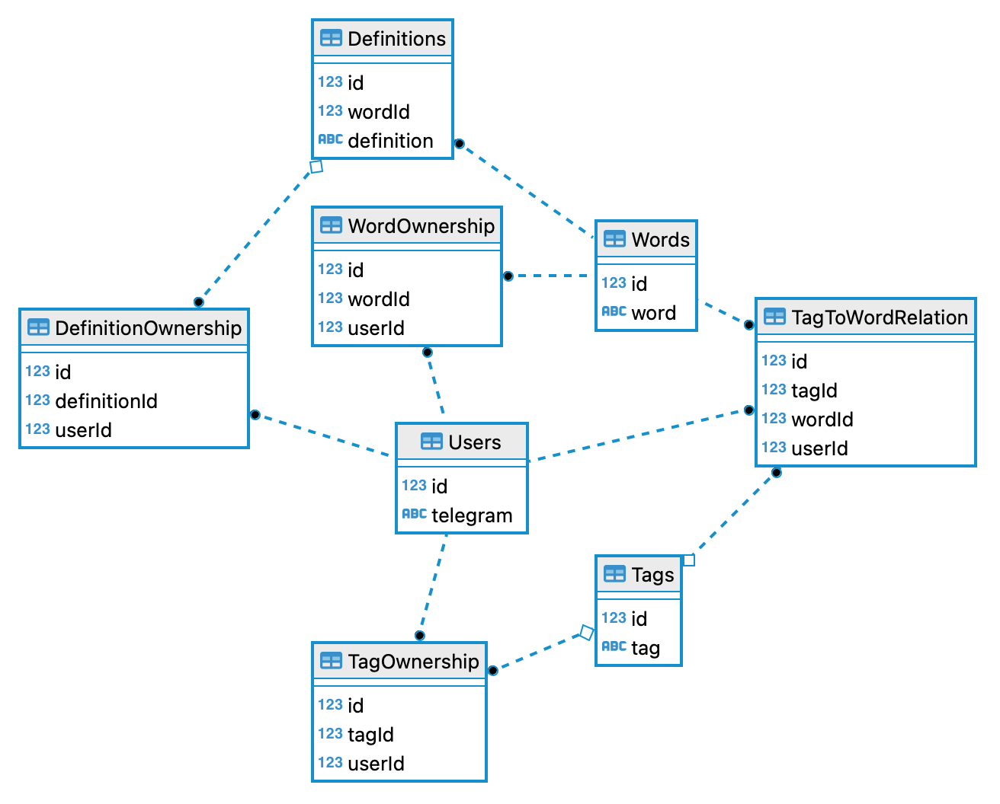

# About
This Telegram bot aids language learning by assisting users in learning new words in any language. Features include the ability to load word definitions from an online dictionary (english only for now), export saved words as Anki decks and a built-in repetition training mode for vocabulary reinforcement. Additionally, the bot offers the ability for users to assign tags to words, making it possible to learn more than one language or focus on specific thematic vocabulary.

Designed following the best software architecture principles, the bot ensures ease of maintenance and extendability. 

### [Try it here](https://t.me/improve_vocabulary_9000_bot)

# Scheme

# Database structure

# How to run